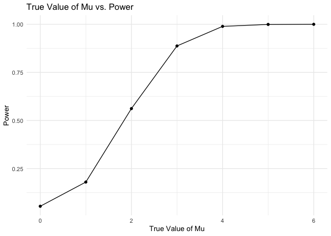

Homework 5
================
Laura Bulmer
11/15/2024

Before starting on the problems, I’m setting up my libraries and options
for visuals.

``` r
library(p8105.datasets)
library(tidyverse)
```

    ## ── Attaching core tidyverse packages ──────────────────────── tidyverse 2.0.0 ──
    ## ✔ dplyr     1.1.4     ✔ readr     2.1.5
    ## ✔ forcats   1.0.0     ✔ stringr   1.5.1
    ## ✔ ggplot2   3.5.1     ✔ tibble    3.2.1
    ## ✔ lubridate 1.9.3     ✔ tidyr     1.3.1
    ## ✔ purrr     1.0.2     
    ## ── Conflicts ────────────────────────────────────────── tidyverse_conflicts() ──
    ## ✖ dplyr::filter() masks stats::filter()
    ## ✖ dplyr::lag()    masks stats::lag()
    ## ℹ Use the conflicted package (<http://conflicted.r-lib.org/>) to force all conflicts to become errors

``` r
library(ggridges)
library(patchwork)

theme_set(theme_minimal() + theme(legend.position = "bottom"))

options(
  ggplot2.continuous.colour = "viridis",
  ggplot2.continuous.fill = "viridis"
)

scale_colour_discrete = scale_colour_viridis_d
scale_fill_discrete = scale_fill_viridis_d
```

## Problem 2

``` r
sim_prob2 = function (samp_size = 30, sigma = 5, mu = 0) {
  
  prob2_df = 
  tibble (
    x = rnorm(n = samp_size, mean = mu, sd = sigma)
  )
  

}
```

## Problem 3

``` r
# Loading in the data. 

homicides_raw= 
  read_csv("data/homicide-data.csv")
```

    ## Rows: 52179 Columns: 12
    ## ── Column specification ────────────────────────────────────────────────────────
    ## Delimiter: ","
    ## chr (9): uid, victim_last, victim_first, victim_race, victim_age, victim_sex...
    ## dbl (3): reported_date, lat, lon
    ## 
    ## ℹ Use `spec()` to retrieve the full column specification for this data.
    ## ℹ Specify the column types or set `show_col_types = FALSE` to quiet this message.

Description of the data: The raw data includes information on homicides
in 50 large US cities. Each observation is given an id number (uid), and
then includes the reported date, information on the victim (name, race,
age, sex), the location (city, state, lat and lon), and the disposition.
The raw data contains 12 columns and 52,179 rows.

``` r
# Creating a city_state variable.

homicides_df = 
  homicides_raw %>%
  mutate(
    city_state = paste(city,state, sep= ", ")
  )

# Summarizing within cites

hom_summarized = 
  homicides_df %>%
    group_by(city_state) %>%
    summarize(
      total_hom = n(),
      unsolved_hom = sum(disposition %in% c("Closed without arrest", "Open/No arrest"))
    )
```

After creating the new variable and summarizing within cities, the next
step is to estimate the proportion of homicides that are unsolved in
Baltimore.

``` r
# Running prop.test on Baltimore, MD.

baltimore =
  prop.test(
    x = hom_summarized %>% filter(city_state == "Baltimore, MD") %>% pull(unsolved_hom),
    n = hom_summarized %>% filter(city_state == "Baltimore, MD") %>% pull(total_hom),
  ) %>%
  broom::tidy()

# Pulling out the proportion and CIs.

baltimore %>%
  pull(estimate)
```

    ##         p 
    ## 0.6455607

``` r
baltimore %>% 
  pull(conf.low)
```

    ## [1] 0.6275625

``` r
baltimore %>% 
  pull(conf.high)
```

    ## [1] 0.6631599

As pulled out above, the estimated proportion of unsolved homicides in
Baltimore was .6456. The CI was (.6276, .6632).

Next, we will repeat this for the other cities in our dataset.

``` r
# Finding the proportion and CIs for all cities.

results_props = 
  hom_summarized %>%
  mutate(
    results = map2(
      .x = unsolved_hom, 
      .y = total_hom, 
      ~prop.test(x=.x, n=.y) %>% broom::tidy())
  )%>%
  unnest(results) %>%
  select(city_state, estimate, conf.low, conf.high)
```

    ## Warning: There was 1 warning in `mutate()`.
    ## ℹ In argument: `results = map2(...)`.
    ## Caused by warning in `prop.test()`:
    ## ! Chi-squared approximation may be incorrect

``` r
results_props %>%
  arrange(estimate)%>%
  mutate(city_state = factor(city_state, levels = city_state)) %>%
  ggplot(aes(x = city_state, y = estimate)) +
  geom_point(color = "blue", size = 3) +
  geom_errorbar(aes(ymin = conf.low, ymax = conf.high), width = 0.2) +
  coord_flip() + 
  labs(
    title = "Proportion of Unsolved Homicides by City",
    x = "City",
    y = "Estimated Proportion of Unsolved Homicides"
  )
```

<!-- -->
