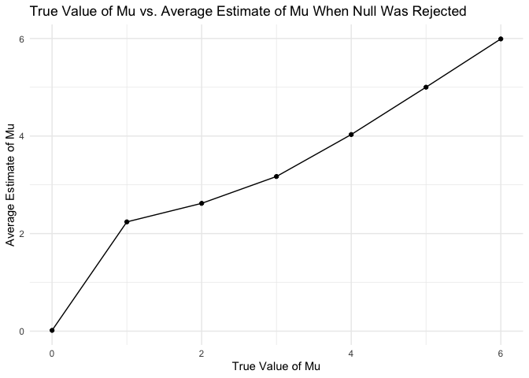

Homework 5
================
Laura Bulmer
11/15/2024

Before starting on the problems, I’m setting up my libraries and options
for visuals.

``` r
library(p8105.datasets)
library(tidyverse)
```

    ## ── Attaching core tidyverse packages ──────────────────────── tidyverse 2.0.0 ──
    ## ✔ dplyr     1.1.4     ✔ readr     2.1.5
    ## ✔ forcats   1.0.0     ✔ stringr   1.5.1
    ## ✔ ggplot2   3.5.1     ✔ tibble    3.2.1
    ## ✔ lubridate 1.9.3     ✔ tidyr     1.3.1
    ## ✔ purrr     1.0.2     
    ## ── Conflicts ────────────────────────────────────────── tidyverse_conflicts() ──
    ## ✖ dplyr::filter() masks stats::filter()
    ## ✖ dplyr::lag()    masks stats::lag()
    ## ℹ Use the conflicted package (<http://conflicted.r-lib.org/>) to force all conflicts to become errors

``` r
library(ggridges)
library(patchwork)

theme_set(theme_minimal() + theme(legend.position = "bottom"))

options(
  ggplot2.continuous.colour = "viridis",
  ggplot2.continuous.fill = "viridis"
)

scale_colour_discrete = scale_colour_viridis_d
scale_fill_discrete = scale_fill_viridis_d
```

## Problem 1

``` r
# First putting people in the room and checking duplicates.

bday_sim = function(n) {
  bdays = sample(1:365, size = n, replace = TRUE)
  duplicate = length(unique(bdays)) < n
  return(duplicate)
}
bday_sim(10)
```

    ## [1] FALSE

``` r
# Running the function 10000 times for each group size 2-50.

sim_res = 
  expand_grid(
    n = 2:50,
    iter = 1:10000
  ) |> 
  mutate(res = map_lgl(n, bday_sim)) |> 
  group_by(n) |> 
  summarize(prob = mean(res))

sim_res |> 
  ggplot(aes(x = n, y = prob )) + 
  geom_line()
```

<!-- -->

From this plot, we can conclude that as group size increases, the
likelihood of shared birthdays will also increase.

## Problem 2

``` r
# First we are setting the function.

sim_prob2 = function (samp_size = 30, mu=0, sigma=5) {
  
  sim_df = 
  tibble (
    x = rnorm(n = samp_size, mean = mu, sd = sigma)
  )
  
  test = t.test(x ~ 1, data = sim_df) %>%
    broom::tidy(test)
}
```

``` r
# Next we are running the function for mu 0-6.

results_prob2 = 
  tibble(mu = 0:6) %>%
  mutate(
    output_df = map(.x=mu, ~rerun(5000, sim_prob2(samp_size=30, mu = .x))),
    value_df = map(output_df, bind_rows)
  )
```

    ## Warning: There was 1 warning in `mutate()`.
    ## ℹ In argument: `output_df = map(.x = mu, ~rerun(5000, sim_prob2(samp_size = 30,
    ##   mu = .x)))`.
    ## Caused by warning:
    ## ! `rerun()` was deprecated in purrr 1.0.0.
    ## ℹ Please use `map()` instead.
    ##   # Previously
    ##   rerun(5000, sim_prob2(samp_size = 30, mu = .x))
    ## 
    ##   # Now
    ##   map(1:5000, ~ sim_prob2(samp_size = 30, mu = .x))

``` r
results_prob2 = 
  results_prob2 %>%
  unnest(value_df) %>%
  select(estimate, p.value, mu) %>%
  mutate(
    sig_results = as.numeric(p.value<.05)
  )
```

The next step is to plot the proportion of times the null was rejected
on the y axis and the true value of mu on the x axis.

Association between effect size and power: As effect size increases, so
does power.

``` r
# Plotting Power vs. True Value of Mu

results_prob2 %>%
  group_by(mu) %>%
  summarize(power = mean(sig_results)) %>%
  ggplot(aes(x = mu, y = power)) +
  geom_point()+
  geom_line()+
  labs(
    title = "True Value of Mu vs. Power",
    x = "True Value of Mu",
    y = "Power"
  )
```

<!-- -->

The next step is plotting the average estimate of 𝜇̂ on the y axis and
the true value of 𝜇 on the x axis.

``` r
results_prob2 %>%
  group_by(mu) %>%
  summarize(estimated_mu = mean(estimate)) %>%
  ggplot(aes(x = mu, y = estimated_mu)) +
  geom_point()+
  geom_line()+
  labs(
    title = "True Value of Mu vs. Average Estimate of Mu",
    x = "True Value of Mu",
    y = "Average Estimate of Mu"
  )
```

<!-- -->

The last step is to plot the average estimate of 𝜇̂ only in samples for
which the null was rejected on the y axis and the true value of 𝜇on the
x axis.

``` r
results_prob2 %>%
  filter(sig_results ==1) %>%
  group_by(mu) %>%
  summarize(estimated_mu = mean(estimate)) %>%
  ggplot(aes(x = mu, y = estimated_mu)) +
  geom_point()+
  geom_line()+
  labs(
    title = "True Value of Mu vs. Average Estimate of Mu When Null Was Rejected",
    x = "True Value of Mu",
    y = "Average Estimate of Mu"
  )
```

<!-- -->

Response: The sample average of mu across tests for which the null is
rejected is approximately equal to the true value of mu at the higher mu
values, but not at the lower ones. This is because as mu gets larger,
the sample mean is more likely to be further from zero, making it easier
to reject the null hypothesis.

## Problem 3

``` r
# Loading in the data. 

homicides_raw= 
  read_csv("data/homicide-data.csv")
```

    ## Rows: 52179 Columns: 12
    ## ── Column specification ────────────────────────────────────────────────────────
    ## Delimiter: ","
    ## chr (9): uid, victim_last, victim_first, victim_race, victim_age, victim_sex...
    ## dbl (3): reported_date, lat, lon
    ## 
    ## ℹ Use `spec()` to retrieve the full column specification for this data.
    ## ℹ Specify the column types or set `show_col_types = FALSE` to quiet this message.

Description of the data: The raw data includes information on homicides
in 50 large US cities. Each observation is given an id number (uid), and
then includes the reported date, information on the victim (name, race,
age, sex), the location (city, state, lat and lon), and the disposition.
The raw data contains 12 columns and 52,179 rows.

``` r
# Creating a city_state variable.

homicides_df = 
  homicides_raw %>%
  mutate(
    city_state = paste(city,state, sep= ", ")
  )

# Summarizing within cites

hom_summarized = 
  homicides_df %>%
    group_by(city_state) %>%
    summarize(
      total_hom = n(),
      unsolved_hom = sum(disposition %in% c("Closed without arrest", "Open/No arrest"))
    )
```

After creating the new variable and summarizing within cities, the next
step is to estimate the proportion of homicides that are unsolved in
Baltimore.

``` r
# Running prop.test on Baltimore, MD.

baltimore =
  prop.test(
    x = hom_summarized %>% filter(city_state == "Baltimore, MD") %>% pull(unsolved_hom),
    n = hom_summarized %>% filter(city_state == "Baltimore, MD") %>% pull(total_hom),
  ) %>%
  broom::tidy()

# Pulling out the proportion and CIs.

baltimore %>%
  pull(estimate)
```

    ##         p 
    ## 0.6455607

``` r
baltimore %>% 
  pull(conf.low)
```

    ## [1] 0.6275625

``` r
baltimore %>% 
  pull(conf.high)
```

    ## [1] 0.6631599

As pulled out above, the estimated proportion of unsolved homicides in
Baltimore was .6456. The CI was (.6276, .6632).

Next, we will repeat this for the other cities in our dataset.

``` r
# Finding the proportion and CIs for all cities.

results_props = 
  hom_summarized %>%
  mutate(
    results = map2(
      .x = unsolved_hom, 
      .y = total_hom, 
      ~prop.test(x=.x, n=.y) %>% broom::tidy())
  )%>%
  unnest(results) %>%
  select(city_state, estimate, conf.low, conf.high)
```

    ## Warning: There was 1 warning in `mutate()`.
    ## ℹ In argument: `results = map2(...)`.
    ## Caused by warning in `prop.test()`:
    ## ! Chi-squared approximation may be incorrect

``` r
results_props 
```

    ## # A tibble: 51 × 4
    ##    city_state      estimate conf.low conf.high
    ##    <chr>              <dbl>    <dbl>     <dbl>
    ##  1 Albuquerque, NM    0.386    0.337     0.438
    ##  2 Atlanta, GA        0.383    0.353     0.415
    ##  3 Baltimore, MD      0.646    0.628     0.663
    ##  4 Baton Rouge, LA    0.462    0.414     0.511
    ##  5 Birmingham, AL     0.434    0.399     0.469
    ##  6 Boston, MA         0.505    0.465     0.545
    ##  7 Buffalo, NY        0.612    0.569     0.654
    ##  8 Charlotte, NC      0.300    0.266     0.336
    ##  9 Chicago, IL        0.736    0.724     0.747
    ## 10 Cincinnati, OH     0.445    0.408     0.483
    ## # ℹ 41 more rows

The next step is to plot the estimates and CIs for each city.

``` r
results_props %>%
  arrange(estimate)%>%
  mutate(city_state = factor(city_state, levels = city_state)) %>%
  ggplot(aes(x = city_state, y = estimate)) +
  geom_point(color = "blue", size = 3) +
  geom_errorbar(aes(ymin = conf.low, ymax = conf.high), width = 0.2) +
  coord_flip() + 
  labs(
    title = "Proportion of Unsolved Homicides by City",
    x = "City",
    y = "Estimated Proportion of Unsolved Homicides"
  )
```

<!-- -->
